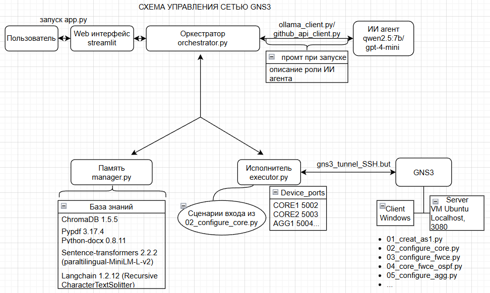
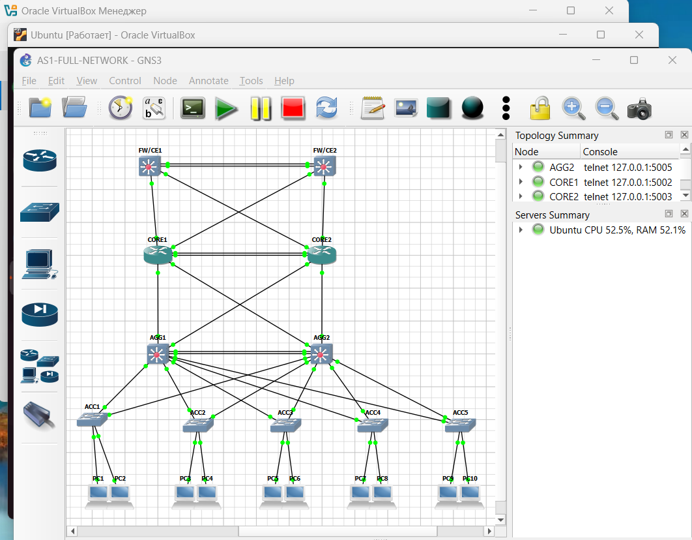
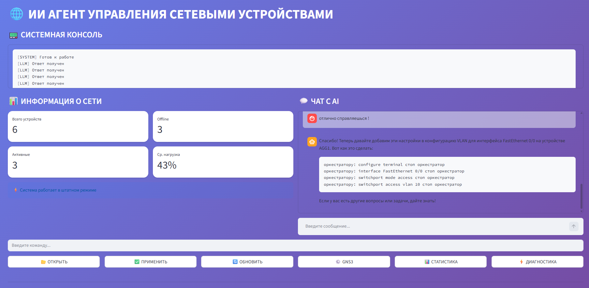

# ИИ агент управления сетью. GNS3 + AI

## 1. О проекте
**Цель:** Создать систему управления сетевыми устройствами в эмуляторе GNS3 через ИИ-агента.

**Что сделано:** 
  В GNS3 созданы элементы первой из 4 автономных систем сети по топологии: ядро-агрегация-доступ-хосты. Настроены OSPF, NAT, BGP.
  Создание и настройка автономной системы написаны скриптами Python: 01_creat_as1.py; 02_configure_core.py; 03_configure_fwce.py; 04_core_fwce_ospf.py; 05_configure_agg.py
  Написаны элементы системы: Web-интерфейс на Streamlit, Запуск - app.py, координатор элементов - orchestrator.py, клиенты ИИ агентов -  ollama_client.py github_api_client.py, Память системы - manager.py, Исполнитель - executor.py

# 2. Архитектура 
## Схема управления сетью GNS3

# 3. Состав сетевого оборудования
 - Пограничные маршрутизаторы CE1 и CE2 Cisco c3745 (NAT и BGP в режиме ожидания, планируется создание еще трёх AS, к которым подключаться)
 - Ядро сети маршрутизаторы CORE1 и CORE2 Cisco c7200 (поднят OSPF, планируется настройка LACP)
 - Агрегация маршрутизаторы AGG1 и AGG2 Cisco c3745 (поднят OSPF)
 - Коммутаторы доступа ACC1-ACC5 Cisco c3725 (не настроены, планируются VLAN)
 - Хосты PC1-PC10
  В скриптах по созданию и настройке оборудования прописаны сценарии входа на оборудование: от настройки с нуля с присвоения пароля, до понимания текущего режима, например привелигированного с целью правильно оценивать применение команд. Еще в скриптах прописаны проверки соседей OSPF и сценарии исправления.

## GNS3

# 4. Как работает сейчас
  При запуске Оркестратор (orchestrator.py) оправляет промт с ролью ИИ агента (в промте сказано что он эксперт Cisco и правило обращения к Оркестратору).
Пользователь пишет в чат что необходимо сделать, сообщение пересылается оркестратором к ИИ агенту. ИИ агент отвечает, ответ пересылается к пользователю.
В случае, если ИИ агент пишет команды настройки оборудования (синтаксис Cisco) с обращением к Оркестратору (в промте сказано как обращаться), то Оркестратор берет команды Cisco и отправляет их Исполнителю (executor.ry), одновременно отправляет диалог с ИИ агентом в Память (manager.py). В свою очередь Исполнитель подключается к сетевому элементу GNS3, и применяет команды Cisco. В логике Исполнителя прописаны те же сценарии входа в устройство и режимы настройки, как в скриптах по настройке сетевого оборудования GNS3(например как тут:02_configure_core.py). Память записывает диалоги, для дальнейшего использования. Память читает форматы pdf, doc, py (позволяет закидывать мануалы) разбивает текст на чанки (langchain), превращает чанки в вектор (sentence-transformers) сохраняет, а затем и ищет с помощью ChromaDB нужную информацию.
 
## Веб-интерфейс

# 5. Итог:
 - Автономная система в GNS3
 - Основные механизмы работы
 - Взаимодействие пользователя, ИИ агента с системой
 - Масштабируемость и возможность заменять элементы блоками

**Что впереди**
Добавить три AS в GNS3, сделать мониторинг, статистику по логам с дашбордами...

# 6. Как запустить

Требования: GNS3 с образами Cisco (c7200, c3745, c3725), Python, Ollama с моделью qwen2.5:7b

Старт: 

- Создать топологию:
python scripts/01_create_as1.py

 - Настроить ядро:
python scripts/02_configure_core.py

 - Настроить CE:
python scripts/03_configure_fwce.py

 - ...

 - Запустить веб-интерфейс (Anaconda):
streamlit run app/app.py

# 7.  Контакты:

**Архитектор проекта:** Александр Орел

**E-mail:** [oryol.aleks@yandex.ru](mailto:oryol.aleks@yandex.ru)  
**GitHub:** [AI-Network-GNS3](https://github.com/aleks858/AI-Network-GNS3)
